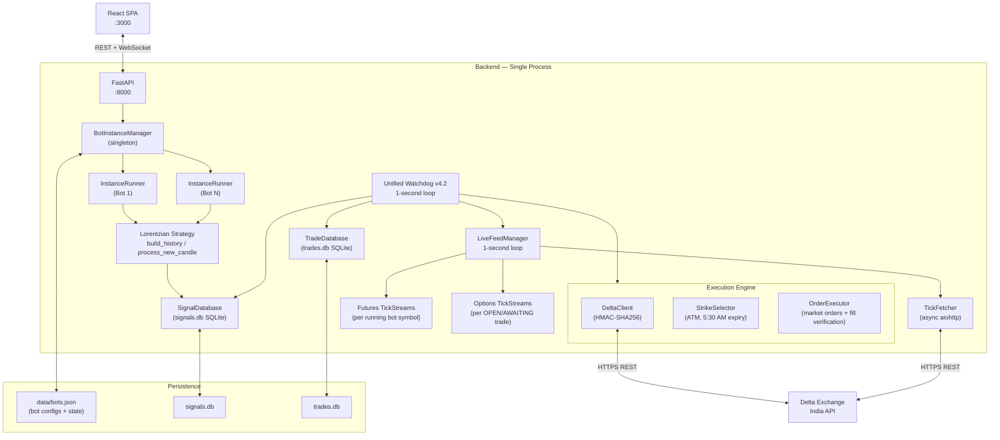
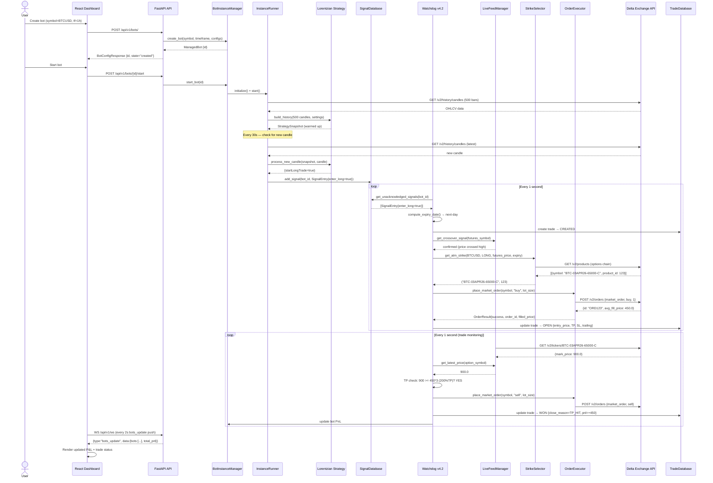
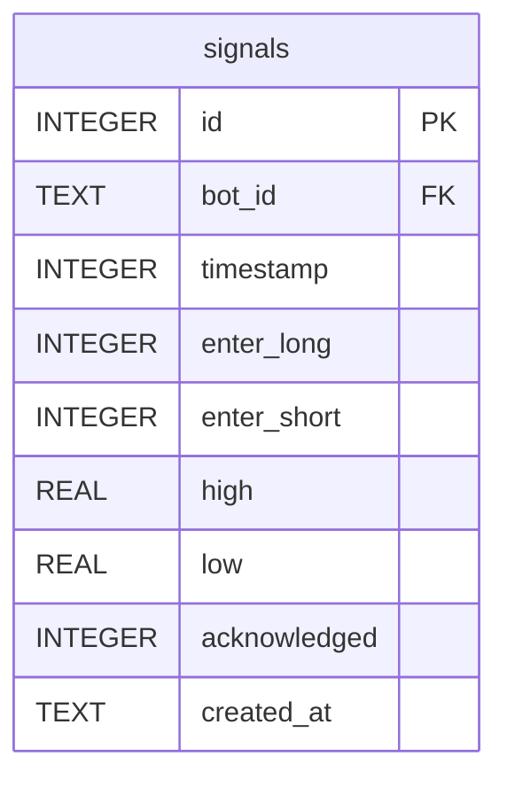
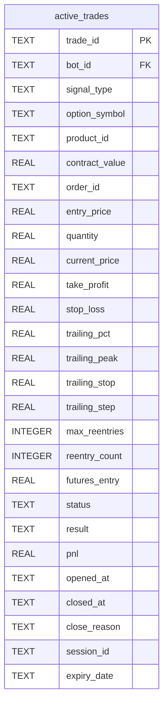
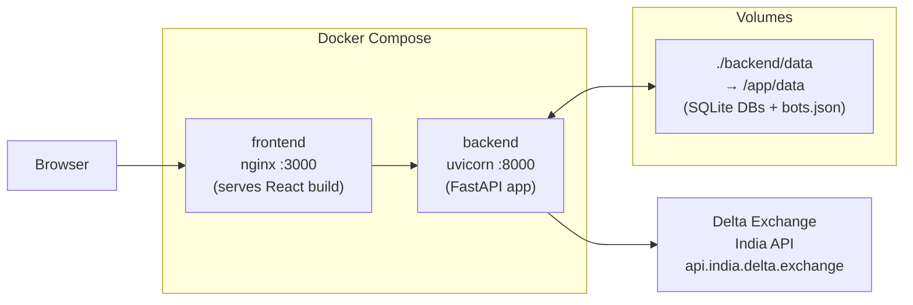

# System Architecture — ANT Meta BOTS

> Generated: 2026-04-02 | Derived strictly from source code analysis.

---

## 1. System Overview

ANT Meta BOTS is a **monolithic async Python backend** paired with a **React SPA frontend**. It connects to a single external service — **Delta Exchange India** — for both market data (OHLCV history and live ticks) and order execution (market orders, fills, instrument listings).

The backend runs four concurrent async subsystems within a single process:

| Subsystem                                  | Entry Point                                    | Role                                              |
| ------------------------------------------ | ---------------------------------------------- | ------------------------------------------------- |
| **REST + WebSocket API**                   | `app/api/`                                     | Serves frontend HTTP and WS requests              |
| **BotInstanceManager + InstanceRunner(s)** | `app/services/bot_manager.py`                  | Manages per-bot candle pools and runs ML strategy |
| **LiveFeedManager**                        | `app/engines/data_engine/live_feed_manager.py` | Dual-feed 1-second tick polling                   |
| **Unified Watchdog v4.2**                  | `app/engines/trade_manager/watchdog.py`        | Signal scanning + full trade lifecycle management |

All four are started during FastAPI's `lifespan` startup sequence and shut down cleanly in reverse order on process exit.

---

## 2. Architecture Diagram



---

## 3. Component Descriptions

### 3.1 FastAPI Application (`app/main.py`)

The entry point. Uses an `asynccontextmanager` lifespan function to:

1. Load persisted bots from `data/bots.json` via `BotInstanceManager`
2. Initialize `TradeDatabase` singleton
3. Start `LiveFeedManager`
4. Start `Watchdog`

On shutdown, the reverse sequence is executed. `BotManager`, `TradeDatabase`, `SignalDatabase`, and their singletons are module-level globals accessed via getter functions (`get_bot_manager()`, `get_trade_database()`, `get_signal_database()`).

### 3.2 BotInstanceManager (`app/services/bot_manager.py`)

A singleton that owns:

- A `Dict[str, ManagedBot]` in-memory registry
- CRUD operations: `create_bot`, `update_bot`, `delete_bot`, `start_bot`, `stop_bot`
- An in-memory rolling log buffer (`deque(maxlen=100)`) per bot plus a system log
- Persistence: `save_to_disk()` / `load_from_disk()` serializing to `data/bots.json`

Each `ManagedBot` holds:

- A reference to its `InstanceRunner` (candle pool + async update loop)
- Its full `trade_config` and `strategy_config` as plain dicts
- `StrategySettings` and `StrategySnapshot` objects (the ML state)

### 3.3 InstanceRunner (`app/engines/instance_runner.py`)

Manages one bot's candle pool:

- `InstanceState` enum: `CREATED → INITIALIZING → RUNNING → PAUSED/STOPPED/ERROR`
- On start: fetches `initial_fetch_count` (500) historical candles via `OHLCVFetcher`
- Every `update_interval` seconds: checks if a new candle has formed (comparing the newest fetched candle's timestamp against the pool's latest), appends if new
- On new candle: `BotManager` runs `process_new_candle()` from the Lorentzian strategy and writes resulting signal to `SignalDatabase`

### 3.4 Lorentzian ML Strategy (`app/engines/strategy_core/lorentzian/`)

A Python port of the MQL5 `Lorentzian_ML_Strategy.mq5` indicator. Core API:

| Function                                         | Description                                                               |
| ------------------------------------------------ | ------------------------------------------------------------------------- |
| `build_history(candles, settings)`               | Warm up the ML model on historical bars, returns `StrategySnapshot`       |
| `process_new_candle(snapshot, candle, settings)` | Update model with one new bar, returns updated snapshot with signal flags |

**ML Algorithm:** k-Nearest Neighbours (KNN) classification using Lorentzian distance metric. For each new bar the algorithm:

1. Extracts up to 5 normalised feature values (RSI, WaveTrend, CCI, ADX — configurable)
2. Searches a training window (max `max_bars_back` bars back, with a 4-bar skip gap) for the `neighbors_count` nearest historical bars by Lorentzian distance
3. Aggregates neighbours' forward-looking direction labels into a prediction score (+1 long, -1 short)
4. Applies Rational Quadratic and Gaussian kernel regression to estimate price trend
5. Passes through up to 5 boolean filters (volatility, regime, ADX, EMA, SMA)
6. Emits `startLongTrade` / `startShortTrade` booleans on signal bars

### 3.5 LiveFeedManager (`app/engines/data_engine/live_feed_manager.py`)

Dual-feed async loop running at `LIVE_FEED_INTERVAL` (default 1 second):

- **Futures feed**: Polls all symbols referenced by running bots. Feeds breakout detection in the Watchdog.
- **Options feed**: Polls all option symbols with status `OPEN` or `AWAITING_REENTRY` in the TradeDatabase. Feeds TP/SL/trailing monitoring.

Each feed maintains a `Dict[symbol, TickStream]` where `TickStream` is a `deque(maxlen=120)` of `Tick` objects. Inactive streams are pruned after a 60-second grace period.

### 3.6 Unified Watchdog v4.2 (`app/engines/trade_manager/watchdog.py`)

The central trade orchestrator. Runs a `while True` loop at `WATCHDOG_INTERVAL` (1 second):

**Phase 0 — Session management:**  
Resolves the current session ID (`S-YYYYMMDD`) based on the 5:30 AM IST boundary. Checks each active session for force-close eligibility (5:00 PM IST on that session's expiry date).

**Phase 1 — Signal Scanner** (skipped if current session is force-closed):  
Reads unacknowledged signals from `SignalDatabase` for each running bot. For each LONG/SHORT signal:

- Evaluates the "Best of N" signals (compares breakout prices across last `BEST_OF_N_SIGNALS` = 3 signals)
- Computes option expiry date using the 5:30 AM rule (locked at signal time)
- Creates `ActiveTrade` records in `TradeDatabase` with status `CREATED`
- Direction-slot enforcement: same-direction OPEN trade → ignore; opposite-direction → schedule for close

**Phase 2 — Trade Manager** (always runs):

- **CREATED trades**: Verifies a breakout crossover on the live futures feed (using `CROSSOVER_LOOKBACK_TICKS` = 10 ticks). On confirmation: calls `StrikeSelector.get_atm_strike()`, then `OrderExecutor.place_market_order()`, then resolves actual fill price via `DeltaClient.get_actual_fill_price()`. Sets trade to `OPEN`.
- **OPEN trades**: Monitors options tick price. Checks take-profit, stop-loss, and step-based trailing stop. On exit condition: closes trade, sets status to `WON`/`CLOSED` with appropriate `close_reason`.
- **AWAITING_REENTRY trades**: Waits for a crossover on the options feed (not futures), then re-executes entry. Increments `reentry_count`. On exhaustion: status → `CLOSED`.

### 3.7 Execution Engine

| Component        | File                                  | Role                                                                                                                                                                      |
| ---------------- | ------------------------------------- | ------------------------------------------------------------------------------------------------------------------------------------------------------------------------- |
| `DeltaClient`    | `execution_engine/delta_client.py`    | HMAC-SHA256 signed REST calls to Delta Exchange India. Handles session management (`aiohttp.ClientSession`), 3-retry exponential backoff, product ID caching (5 min TTL). |
| `StrikeSelector` | `execution_engine/strike_selector.py` | Fetches live options chain for an underlying, filters to target expiry date (computed via 5:30 AM rule), selects the ATM strike nearest to the current futures price.     |
| `OrderExecutor`  | `execution_engine/order_executor.py`  | Wraps `DeltaClient.place_order()` into a structured `OrderResult`. Also provides `get_actual_fill_price()` to verify fills post-execution.                                |

### 3.8 Data Layer

| Store        | Technology | Location          | Contents                                                    |
| ------------ | ---------- | ----------------- | ----------------------------------------------------------- |
| Bot registry | JSON       | `data/bots.json`  | Bot configs, states, created_at, PnL per bot                |
| Signal store | SQLite     | `data/signals.db` | `signals` table — per-bot rolling window of strategy output |
| Trade store  | SQLite     | `data/trades.db`  | `active_trades` table — full trade lifecycle records        |

---

## 4. Data Flow Diagram — Primary User Journey



---

## 5. Database Schema

### 5.1 `signals.db` — `signals` table



- `timestamp` is a Unix epoch (seconds) matching the candle close time.
- `enter_long` / `enter_short` are SQLite integers (0/1) representing booleans.
- `acknowledged` is set to `1` once the Watchdog has processed the signal.
- An index on `(bot_id, timestamp DESC)` supports efficient lookback queries.
- Rolling window enforced in application logic: old signals pruned to `signal_lookback` per bot.

### 5.2 `trades.db` — `active_trades` table



**Status values:** `CREATED` → `OPEN` → `WON` | `CLOSED` | `AWAITING_REENTRY` | `EXPIRED`  
**Result values:** `PROFIT` | `LOSS` | `null`  
**Close reasons:** `TP_HIT` | `SL_HIT` | `TRAILING_HIT` | `FORCE_CLOSE` | `REENTRY_EXHAUSTED` | `REPLACED_BY_BETTER` | `OPPOSITE_DIRECTION_CLOSE`

### 5.3 Bot Persistence (`data/bots.json`)

A JSON array of bot config snapshots serialised from `ManagedBot.to_persist_dict()`:

```json
[
  {
    "id": "abc123",
    "symbol": "BTCUSD",
    "timeframe": "1h",
    "update_interval": 30.0,
    "trade_config": { "lot_size": 1, "tp_pct": 200, ... },
    "strategy_config": { "general": {...}, "features": {...}, "filters": {...}, "kernel": {...} },
    "created_at": "2026-03-30T10:00:00",
    "pnl": 150.0,
    "state": "running"
  }
]
```

---

## 6. Key Design Patterns

### 6.1 Singleton Services via Module-Level Globals

`BotInstanceManager`, `TradeDatabase`, and `SignalDatabase` are instantiated once at module load and exposed via getter functions:

```python
_bot_manager: Optional[BotInstanceManager] = None

def get_bot_manager() -> BotInstanceManager:
    global _bot_manager
    if _bot_manager is None:
        _bot_manager = BotInstanceManager()
    return _bot_manager
```

This pattern avoids dependency injection overhead while ensuring a single instance per process.

### 6.2 Async Cooperative Concurrency (No Threads)

All I/O-bound work (HTTP requests, SQLite writes, WebSocket pushes) runs on the single-threaded asyncio event loop. CPU-bound strategy computation runs synchronously within the loop; it is fast enough at the current scale (< 1 ms per candle).

### 6.3 Layered Configuration via Pydantic BaseSettings

`Settings` class reads from environment variables (or `.env` file) with type validation. All components import the module-level `settings` singleton. This provides a single source of truth for all tunable parameters.

### 6.4 Session-Scoped Trade Isolation

Trades are tagged with a `session_id` (`S-YYYYMMDD`) derived from the 5:30 AM IST boundary. Force-close operates per session, allowing overlapping day sessions to coexist without interfering with each other. The `expiry_date` is locked at signal time to prevent execution-time drift.

### 6.5 Direction Slot Model (Per-Bot)

Each bot maintains at most 2 simultaneously active trades: 1 LONG slot + 1 SHORT slot. The Watchdog enforces:

- **Same direction** while OPEN: new signal ignored, original expiry preserved
- **Opposite direction** while OPEN: existing trade queued for close, new trade opened with new expiry

### 6.6 Best-of-N Signal Selection

Rather than acting on the first signal, the Watchdog examines the last `BEST_OF_N_SIGNALS` (3) unacknowledged signals for a bot and selects the one with the optimal breakout price (highest high for LONG, lowest low for SHORT). This reduces false entries on noisy signal clusters.

### 6.7 Dual-Feed Live Data

Separating futures and options tick streams allows:

- Breakout crossover detection to use futures continuity (no intraday gaps)
- TP/SL/trailing decisions to use actual options mark price (reflects time-value decay)

### 6.8 JWT Authentication with Single-User Credential Store

Authentication is a hardcoded single-user model (username/password from environment variables). Tokens are signed with HS256 and expire after 24 hours. All REST endpoints and the WebSocket endpoint enforce token validation via a shared `decode_access_token()` utility.

### 6.9 HMAC-SHA256 API Signing

Delta Exchange requires request signing: `HMAC(secret, method + timestamp + path + query + body)`. The `DeltaClient._sign_request()` method builds these headers for all authenticated endpoints. The API key/secret are re-read from `settings` on every signed request to pick up runtime credential updates.

---

## 7. Dependency Flow

```
app/main.py
    └── app/api/router.py
            └── app/api/v1/{auth, bots, trades, logs, health, ws}.py
                    └── app/services/{bot_manager, trade_database, signal_database}.py
                                └── app/engines/{instance_runner, data_engine, strategy_core, execution_engine, trade_manager}
                                            └── app/core/{config, constants, security, timezone}
```

Dependency direction is strictly top-down. `core/` has no upward dependencies. `engines/` depends on `core/` and `services/` use `engines/`. `api/` imports from `services/` and `schemas/`.

---

## 8. Deployment Architecture



- **Backend** runs as a non-root `appuser` in a Python 3.11-slim container.
- **Data volume** mounts `./backend/data` into `/app/data` to persist SQLite databases across restarts.
- **Logs** are written to timestamped files in `./backend/logs/` (not volumed by default; add volume mount for production persistence).
- **Health check**: container runtime probes `http://localhost:8000/health` every 30 seconds.

---

## 9. WebSocket Communication

The WebSocket endpoint (`/api/v1/ws?token=<JWT>`) implements a push-only model:

| Message Type  | Push Interval    | Payload                                                 |
| ------------- | ---------------- | ------------------------------------------------------- |
| `bots_update` | 2 seconds        | `{bots: [...], total: N, running: N, total_pnl: float}` |
| `logs_update` | 3 seconds        | `{logs: [...], total: N}`                               |
| `pong`        | On client `ping` | `{}`                                                    |

Client can send `{"type": "subscribe_logs", "source": "System" | bot_id}` to filter log updates. On `4001` close code (auth failure), the frontend suppresses reconnection attempts.

---

## 10. Extension Points

| Extension                    | Where to Add                                                                                                                                                       |
| ---------------------------- | ------------------------------------------------------------------------------------------------------------------------------------------------------------------ |
| New trading symbol           | Add to `SUPPORTED_SYMBOLS` in `core/constants.py`; no other changes needed                                                                                         |
| New ML feature type          | Add enum value to `ENUM_FEATURE_TYPE` in `strategy_core/lorentzian/types.py`, implement in `ml_extensions.py`, add branch in `CalculateFeature()` in `strategy.py` |
| New order type (e.g., limit) | Extend `OrderType` enum and `place_market_order()` in `order_executor.py`                                                                                          |
| Multi-user auth              | Replace `authenticate_user()` in `core/security.py` with a user database lookup                                                                                    |
| PostgreSQL persistence       | Implement `TradeDatabase` / `SignalDatabase` with asyncpg or SQLAlchemy async                                                                                      |
| Telegram notifications       | `TELEGRAM_BOT_TOKEN` / `TELEGRAM_CHAT_ID` settings are already wired; implement a `TelegramNotifier` service injected into the Watchdog                            |

---

_Blueprint generated: 2026-04-02. Update this document when architectural boundaries change — particularly session management logic, Watchdog phases, or the execution engine signing protocol._
