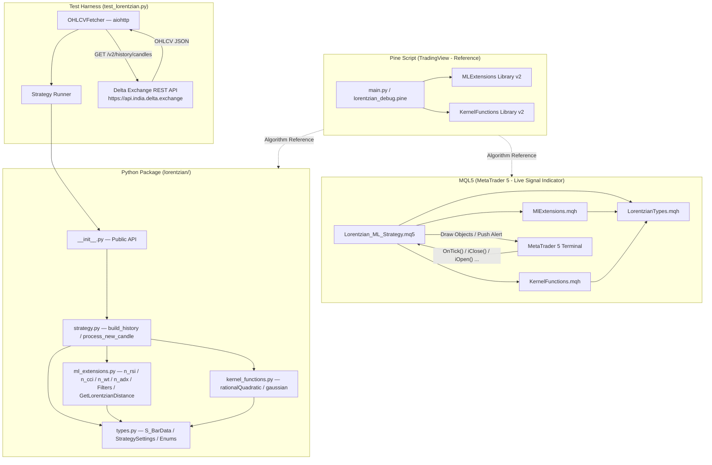
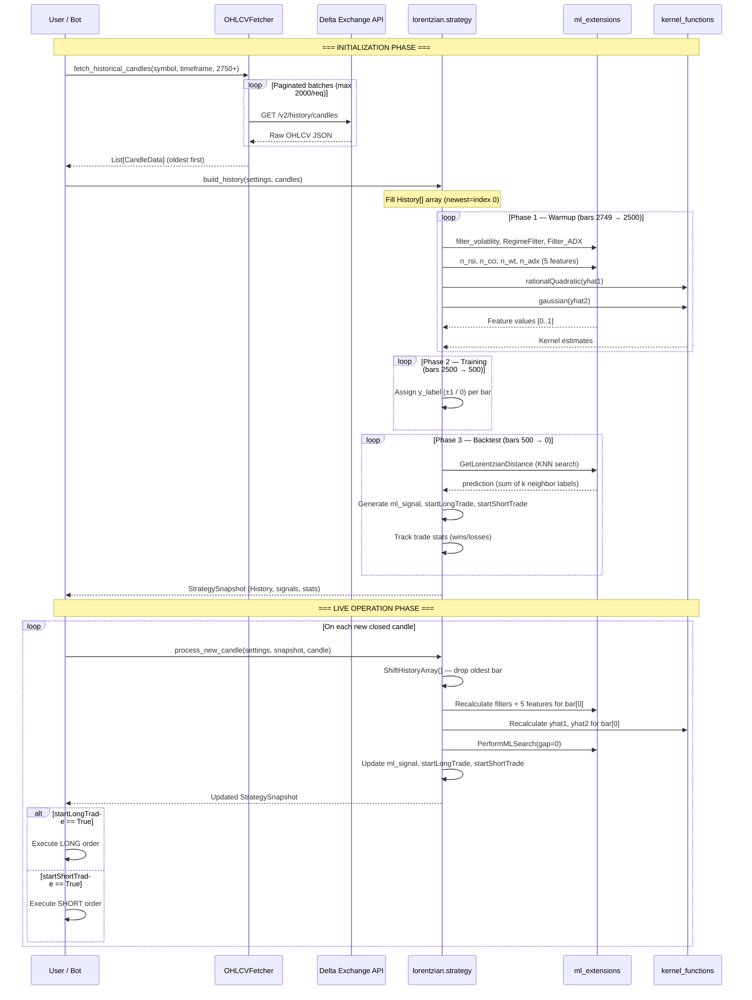
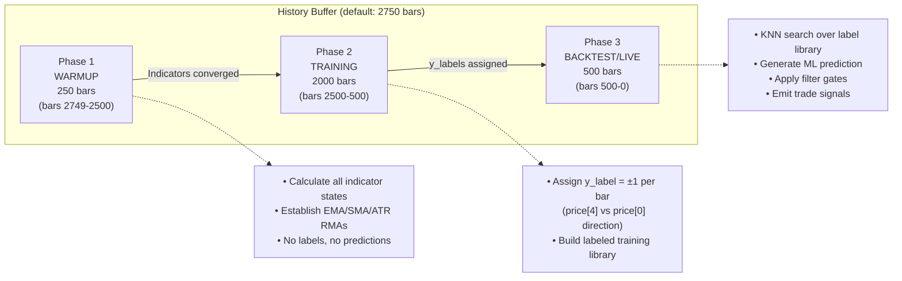
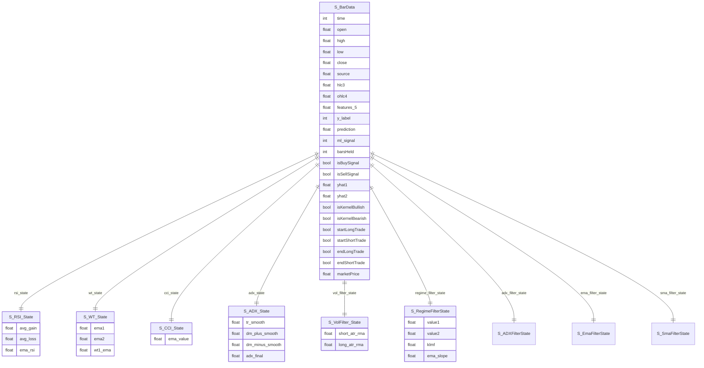
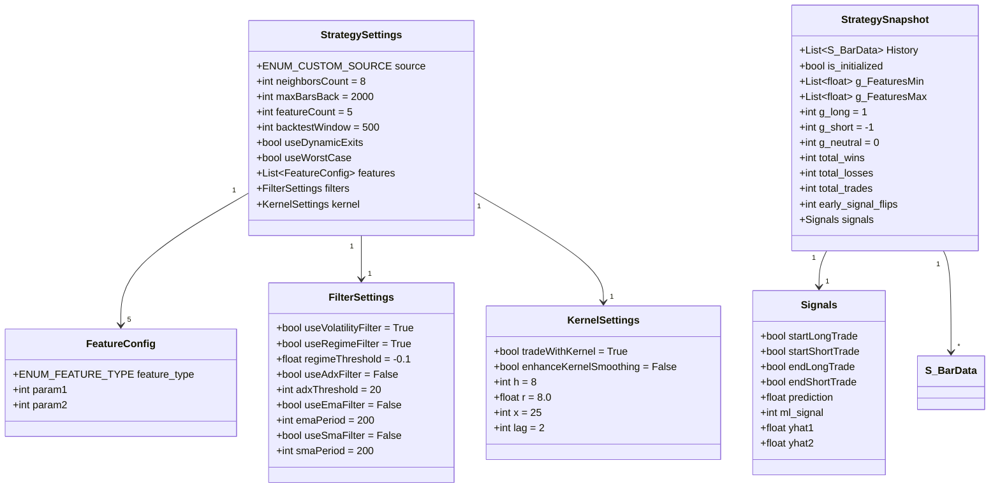
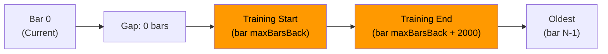
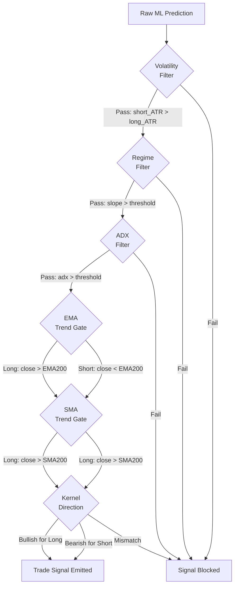

# Architecture

> Generated: April 3, 2026 | Version: 2.1.0 (Python), 3.0 (MQL5)

---

## Table of Contents

1. [System Overview](#1-system-overview)
2. [Architecture Diagram](#2-architecture-diagram)
3. [Data Flow Diagram](#3-data-flow-diagram)
4. [Three-Phase Processing Model](#4-three-phase-processing-model)
5. [Data Structures / Models](#5-data-structures--models)
6. [Component Reference](#6-component-reference)
7. [Key Design Patterns](#7-key-design-patterns)
8. [Lorentzian KNN Algorithm](#8-lorentzian-knn-algorithm)
9. [Kernel Regression](#9-kernel-regression)
10. [Filter Pipeline](#10-filter-pipeline)
11. [Signal Generation Logic](#11-signal-generation-logic)
12. [Extension & Configuration Guide](#12-extension--configuration-guide)

---

## 1. System Overview

This repository contains **three parallel implementations** of the same trading strategy:

| Implementation     | Language       | Role                                                                         |
| ------------------ | -------------- | ---------------------------------------------------------------------------- |
| **Pine Script**    | Pine Script v5 | Original reference indicator (TradingView)                                   |
| **MQL5 Indicator** | MQL5           | Live signal indicator for MetaTrader 5 (visual + alerts, no order execution) |
| **Python Library** | Python 3       | Reusable library; backtesting, automation, algorithmic trading bots          |

The Python implementation is the primary engine for programmatic use. It accepts OHLCV candles from any source (the included test script uses **Delta Exchange** via REST API). The MQL5 indicator renders the same signals and kernel regression lines directly on an MT5 chart.

There is **no shared runtime communication** between the three implementations — they are independently deployable ports of the same mathematical algorithm.

---

## 2. Architecture Diagram



---

## 3. Data Flow Diagram

The sequence below shows a full lifecycle: fetching historical data, initializing the strategy, and processing live candles.



---

## 4. Three-Phase Processing Model

Both the MQL5 and Python implementations share an identical **three-phase pipeline** that runs over the full history buffer on initialization.



**Buffer size formula:** `maxBarsBack (2000) + HISTORY_WARMUP_PERIOD (250) + backtestWindow (500) = 2750 bars minimum`

---

## 5. Data Structures / Models

### Core Bar Record: `S_BarData`

Every bar in the fixed-size ring buffer is stored as a single `S_BarData` struct/dataclass containing all derived state.



### Configuration Structures (Python)



### Enumerations

| Enum                 | Values                                            | Purpose                               |
| -------------------- | ------------------------------------------------- | ------------------------------------- |
| `ENUM_CUSTOM_SOURCE` | `CLOSE, OPEN, HIGH, LOW, HL2, HLC3, OHLC4, HLCC4` | Price source for feature calculations |
| `ENUM_FEATURE_TYPE`  | `RSI=0, WT=1, CCI=2, ADX=3`                       | Feature type selector                 |
| `Direction`          | `LONG=1, SHORT=-1, NEUTRAL=0`                     | ML signal labels and y-labels         |

---

## 6. Component Reference

### `strategy.py` — Public API

| Function             | Signature                                                             | Description                                                                                                    |
| -------------------- | --------------------------------------------------------------------- | -------------------------------------------------------------------------------------------------------------- |
| `build_history`      | `(StrategySettings, List[CandleData]) → StrategySnapshot`             | Full initialization. Loads the ring buffer, runs all three phases. Requires ≥ 2750 candles (default settings). |
| `process_new_candle` | `(StrategySettings, StrategySnapshot, CandleData) → StrategySnapshot` | Processes one new closed candle. Shifts the ring buffer, recalculates indices 0 only. O(maxBarsBack) per call. |
| `execute_trade`      | Internal trade stat helper                                            | Updates `snapshot` win/loss state when a trade opens.                                                          |
| `close_trade`        | Internal trade stat helper                                            | Settles a trade and increments win/loss counters.                                                              |
| `get_trade_stats`    | `(StrategySnapshot) → dict`                                           | Returns win rate, W/L ratio, total trades.                                                                     |
| `print_trade_stats`  | `(StrategySnapshot) → str`                                            | Formatted summary string.                                                                                      |

### `ml_extensions.py` — ML Math

| Function                                                  | Returns                 | Description                                                          |
| --------------------------------------------------------- | ----------------------- | -------------------------------------------------------------------- |
| `n_rsi(history, i, n1, n2)`                               | `float [0,1]`           | Normalized RSI: Wilder RMA smoothed, then EMA smoothed, rescaled 0–1 |
| `n_cci(history, i, n1, n2, min, max)`                     | `(float, float, float)` | Normalized CCI with dynamic min/max tracking                         |
| `n_wt(history, i, n1, n2, min, max)`                      | `(float, float, float)` | Normalized WaveTrend with dynamic min/max tracking                   |
| `n_adx(history, i, n1)`                                   | `float [0,1]`           | Normalized ADX using Wilder smoothing, rescaled 0–1                  |
| `filter_volatility(history, i, min_len, max_len, use)`    | `bool`                  | ATR ratio filter: short ATR > long ATR                               |
| `RegimeFilter(history, i, threshold, use, is_init)`       | `bool`                  | Kalman-like momentum filter using normalized slope                   |
| `Filter_ADX(history, i, period, threshold, use, is_init)` | `bool`                  | ADX value threshold gate                                             |
| `GetLorentzianDistance(history, i, j, featureCount)`      | `float`                 | Core distance metric: `Σ log(1 + \|f_i - f_j\|)`                     |

### `kernel_functions.py` — Nadaraya-Watson Estimators

| Function                                                                  | Returns | Description                                                            |
| ------------------------------------------------------------------------- | ------- | ---------------------------------------------------------------------- |
| `rationalQuadratic(history, index, lookback, relativeWeight, startAtBar)` | `float` | Weighted regression with polynomial decay: `w = (1 + i²/(h²·2r))^(-r)` |
| `gaussian(history, index, lookback, startAtBar)`                          | `float` | Weighted regression with Gaussian decay: `w = exp(-i²/(2h²))`          |

Both functions walk backwards from `index` through the full available history computing a weighted average of `source` values.

---

## 7. Key Design Patterns

### Pattern 1: Exact Cross-Language Parity

All three implementations (Pine Script, MQL5, Python) share **identical function names, struct field names, and algorithm logic**. The Python port uses Python conventions (`snake_case` dataclasses) but every formula, loop boundary, and conditional is a direct translation of the MQL5 version, which itself traces back to the Pine Script original.

This means bugs found in one implementation reveal the same bug in all others, and validation is done by comparing outputs on identical OHLCV input.

### Pattern 2: Self-Contained Ring Buffer

The entire strategy state is held in a **fixed-size array** (`History[]`). Index `0` is always the most recent bar. On each new candle `process_new_candle` calls `ShiftHistoryArray()` which pops the oldest element and inserts an empty slot at `0`. There is no database, no file I/O, and no external state.

```
History[0]   ← newest (just closed)
History[1]   ← 1 bar ago
...
History[N-1] ← oldest
```

### Pattern 3: Per-Bar Indicator State Embedding

Each `S_BarData` record **carries the full intermediate indicator state** at that bar (e.g., `S_RSI_State.avg_gain`, `S_WT_State.ema1`). This is the critical technique that allows the incremental `_rma()` and `_ema()` smoothing functions to read the previous bar's state from `history[i+1]` rather than maintaining separate global accumulator variables. The entire history is thus self-consistent and can be replayed.

### Pattern 4: Ground Truth Label Assignment (`y_label`)

Labels are assigned **4 bars in arrears** using actual future price movement:

```
if price[4] < price[0]:  y_label = SHORT  # price moved up → future label = "was short wrong"
if price[4] > price[0]:  y_label = LONG
else:                    y_label = NEUTRAL
```

This means the training library is fully labeled without look-ahead bias during live prediction (the prediction query bar is never part of its own training window).

### Pattern 5: Modulo-4 KNN Optimization

During `PerformMLSearch`, only training candidates where `relative_index % 4 != 0` are evaluated. This 25% reduction in distance computations matches the original Pine Script behavior and reduces the computational cost from O(N) to O(0.75·N) per prediction.

### Pattern 6: FIFO Nearest-Neighbor Queue with Warp

The KNN algorithm maintains a fixed-size candidate list of `neighborsCount` (default 8) neighbors using a FIFO eviction window. The distance threshold `lastDistance` is updated to the **75th percentile** of the current candidate list (`distances[round(k * 0.75)]`) rather than the maximum, causing the neighborhood to "warp" and continuously refine toward denser clusters of similar patterns.

### Pattern 7: Dual-Kernel Trend Confirmation

Two kernel estimates are computed independently per bar:

- **`yhat1`**: `rationalQuadratic(h=8, r=8.0, x=25)` — broader trend estimate
- **`yhat2`**: `gaussian(h=8-lag=6, x=25)` — shorter/lagged trend estimate

The comparison `yhat2 >= yhat1` (smooth mode) or `yhat1[1] < yhat1[0]` (rate mode) determines kernel bullishness. A trade signal only fires when **ML prediction + all active filters + kernel direction** all agree.

---

## 8. Lorentzian KNN Algorithm

The core distance metric replaces Euclidean distance to better handle the non-linear "warping" of price-time space near major market events:

$$d_{Lorentzian}(i, j) = \sum_{k=1}^{n} \log\left(1 + |f_k^{(i)} - f_k^{(j)}|\right)$$

Where $f_k$ are the $n$ normalized technical features (default $n=5$).

**Properties vs. Euclidean:**

- Logarithmic growth bounds the influence of large outliers
- Small differences are weighted more heavily (better for identifying subtle regime similarities)
- Naturally discounts feature distances caused by black-swan price events

**Search Window:**



Live operation always uses `gap=0` (prediction based on the current bar looking back into the labeled library).

---

## 9. Kernel Regression

Both kernels implement **Nadaraya-Watson non-parametric regression**: a weighted average of all historical `source` values where the weight decays with temporal distance from the current bar.

| Parameter             | Symbol | Default | Effect                                                     |
| --------------------- | ------ | ------- | ---------------------------------------------------------- |
| `h` (lookback)        | $h$    | 8       | Controls bandwidth — higher = smoother estimate            |
| `r` (relative weight) | $r$    | 8.0     | Rational Quadratic only — controls polynomial decay rate   |
| `x` (startAtBar)      | $x$    | 25      | Extends the regression window start point                  |
| `lag`                 | —      | 2       | Shortens lookback for Gaussian: `h_gaussian = h - lag = 6` |

The Gaussian with shorter lookback makes `yhat2` more responsive than `yhat1`, so `yhat2 > yhat1` indicates the fast estimate is above the slow estimate (bullish momentum).

---

## 10. Filter Pipeline

All filters must pass simultaneously (`filter_all = vol_ok AND reg_ok AND adx_ok`) for a signal to fire. Each filter is independently togglable.



| Filter         | Mechanism                                                                   | Default  |
| -------------- | --------------------------------------------------------------------------- | -------- |
| **Volatility** | `short_ATR_RMA(1) > long_ATR_RMA(10)` — expanding volatility required       | Enabled  |
| **Regime**     | Normalized KLMF slope > `regimeThreshold (-0.1)` — trending market required | Enabled  |
| **ADX**        | ADX value > `adxThreshold (20)` — trend strength gate                       | Disabled |
| **EMA**        | Price vs. 200-period EMA (directional gate, not a block)                    | Disabled |
| **SMA**        | Price vs. 200-period SMA (directional gate, not a block)                    | Disabled |
| **Kernel**     | `yhat2 >= yhat1` (or rate of change) must agree with trade direction        | Enabled  |

---

## 11. Signal Generation Logic

A trade signal requires the full conjunction of independently gated conditions:

```
startLongTrade  = isNewBuySignal  AND isKernelBullish
startShortTrade = isNewSellSignal AND isKernelBearish

isNewBuySignal  = (ml_signal == LONG)  AND isEmaUptrend AND isSmaUptrend AND isDifferentSignalType
isNewSellSignal = (ml_signal == SHORT) AND isEmaDowntrend AND isSmaDowntrend AND isDifferentSignalType

ml_signal = LONG   if (prediction > 0 AND filter_all)
          = SHORT  if (prediction < 0 AND filter_all)
          = prev_signal  (hold last)
```

**Exit logic** (strict mode) triggers 4 bars after entry:

```
endLongTrade  = (held 4 bars AND last signal was buy) OR (held < 4 AND new sell flip) AND entry[4].startLongTrade
endShortTrade = (held 4 bars AND last signal was sell) OR (held < 4 AND new buy flip) AND entry[4].startShortTrade
```

---

## 12. Extension & Configuration Guide

### Adding a New Feature Type

1. Add the enum value to `ENUM_FEATURE_TYPE` in `types.py` and `LorentzianTypes.mqh`.
2. Implement the normalization function in `ml_extensions.py` and `MlExtensions.mqh` following the `n_rsi()` pattern (accept `history[]`, index `i`, parameters; return `float [0,1]`).
3. Add the dispatch branch in `CalculateFeature()` in `strategy.py` and its MQL5 counterpart.

### Changing the Number of Features

The `featureCount` setting controls how many features are included in `GetLorentzianDistance()`. The array `features[5]` is fixed-size; increase it in `S_BarData` and `FeatureConfig` defaults together.

### Consuming from a Different Exchange

Replace `OHLCVFetcher` in `test_lorentzian.py`. The strategy only needs a sorted `List[CandleData]` (oldest first). The `CandleData` dataclass requires `timestamp`, `open`, `high`, `low`, `close`, `volume`.

### Tuning the KNN Neighborhood

| Parameter                            | Effect                                                      |
| ------------------------------------ | ----------------------------------------------------------- |
| `neighborsCount` (default 8)         | Larger k = smoother, less reactive predictions              |
| `maxBarsBack` (default 2000)         | Larger window = more training data, slower first init       |
| Feature params (e.g., RSI period 14) | Affect the normalized feature values fed to distance metric |

### Architecture Consistency Rules

- **Index 0 is always the newest bar.** All lookbacks use `history[i+1]`, `history[i+2]`, etc.
- **Never mutate `history[i]` from a different bar's calculation context.** Each bar's state is computed once in the processing loop, oldest-to-newest.
- **All features must be normalized to [0, 1]** before being fed to `GetLorentzianDistance`. Raw values would cause the Lorentzian distance to be biased toward high-magnitude features.
- **`build_history` must be called before `process_new_candle`.** The library does not perform lazy initialization.
