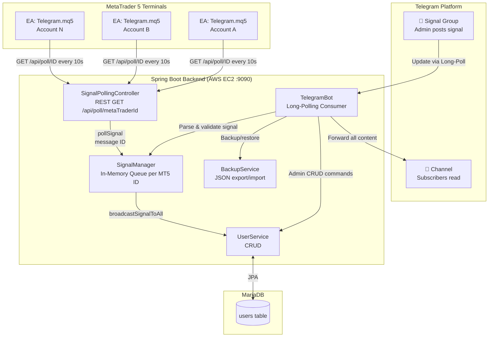
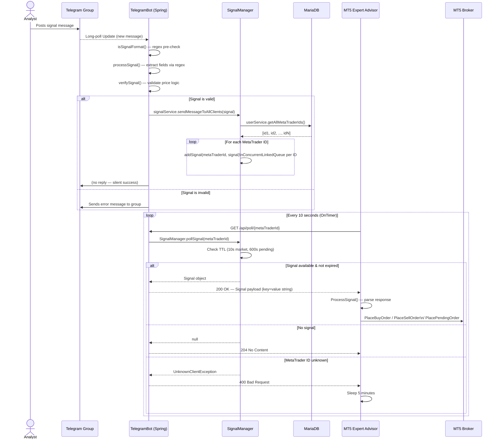
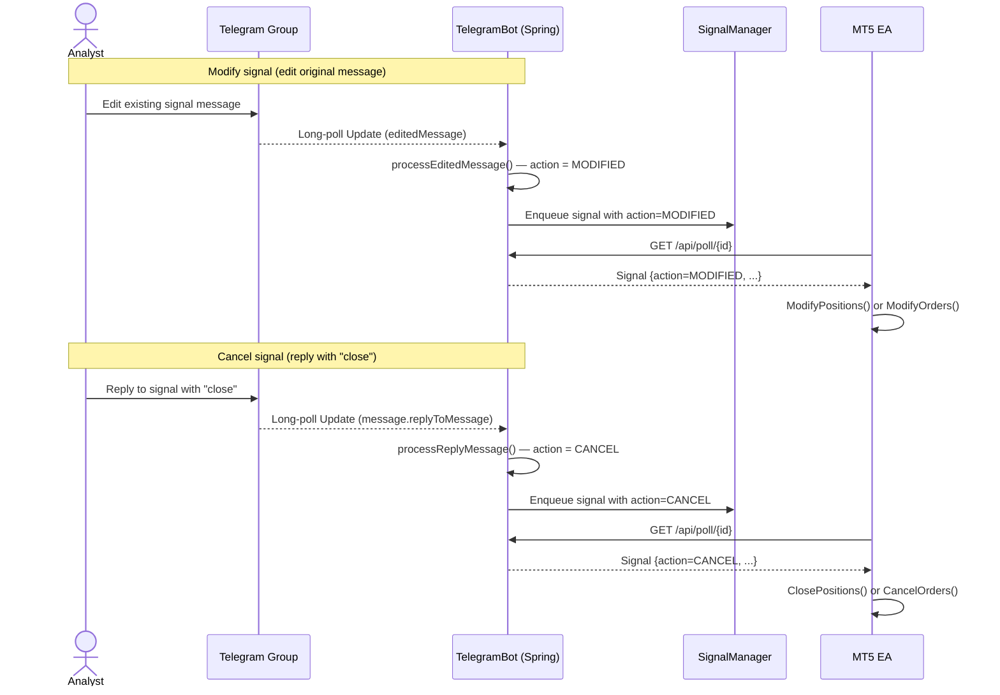
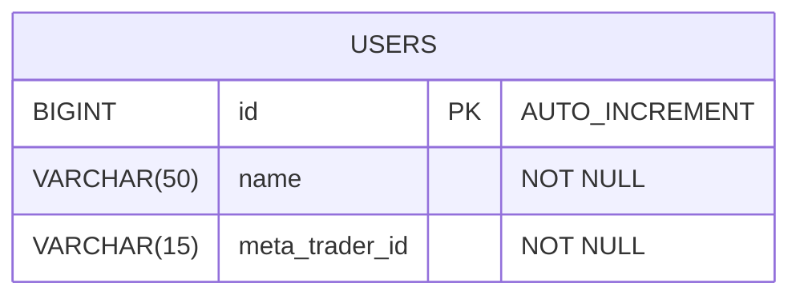

# Architecture

This document describes the system design, component responsibilities, data flows, and database schema of the Telegram Signal Copier.

---

## System Overview

The system bridges two ecosystems: **Telegram** (signal source) and **MetaTrader 5** (trade executor).

1. A human analyst posts a structured trading signal into a private Telegram **group**.
2. The Spring Boot backend, running a long-polling Telegram bot, receives the update in real time.
3. The bot parses the message, validates the signal values, and enqueues the signal into a per-account in-memory queue managed by `SignalManager`.
4. Each registered MT5 account runs an Expert Advisor (EA) that calls the server's REST endpoint every 10 seconds.
5. When a signal is present in the queue, the EA dequeues it and executes the corresponding trade(s) on the live broker account.
6. Simultaneously, the bot mirrors all group messages (text, photos, videos, documents, stickers, polls) to a read-only Telegram **channel** for subscriber access.

There is **no browser-based frontend**. All operator interaction occurs through Telegram bot commands in a private chat.

---

## Architecture Diagram



---

## Data Flow Diagram

The following sequence diagram traces the complete lifecycle of a single trading signal from creation to trade execution.



### Edit & Cancel Signal Flow



---

## Telegram Signal Format

The bot uses **seven regex patterns** to detect and parse signals. A valid signal must contain all of the following in a single message (or photo caption):

```
#EURUSD
#BUY

Entry Point: 1.0850
Stop Loss (SL): 1.0820
Take Profit (TP1): 1.0880
Take Profit (TP2): 1.0910
Take Profit (TP3): 1.0940
```

Supported order types: `BUY`, `SELL`, `BUY LIMIT`, `SELL LIMIT`, `BUY STOP`, `SELL STOP`.

---

## Database Schema / Entity Model

The schema is minimal — a single `users` table maps human-readable trader names to their MT5 account login numbers.



### `users`

| Column           | Type          | Constraints                     | Description                                            |
| ---------------- | ------------- | ------------------------------- | ------------------------------------------------------ |
| `id`             | `BIGINT`      | `PRIMARY KEY`, `AUTO_INCREMENT` | Surrogate key                                          |
| `name`           | `VARCHAR(50)` | `NOT NULL`                      | Display name of the trader                             |
| `meta_trader_id` | `VARCHAR(15)` | `NOT NULL`                      | MT5 account login number (used as the poll identifier) |

> **No foreign keys or join tables.** The `SignalManager` uses `metaTraderId` as the sole routing key for queued signals.

---

## Key Design Patterns & Decisions

### 1. In-Memory Signal Queue (Producer-Consumer)

`SignalManager` maintains a `ConcurrentHashMap<String, ConcurrentLinkedQueue<Signal>>` — one queue per registered MetaTrader ID. The Telegram bot is the **producer** (via `broadcastSignalToAll`); the REST controller is the **consumer** (via `pollSignal`). This avoids a persistent message-broker dependency and keeps the infrastructure lightweight.

### 2. TTL-Based Signal Expiry

When an MT5 EA polls a signal, `pollSignal()` inspects each queued entry's `createdAt` timestamp:

- **Market orders** (`BUY`, `SELL`) expire after **10 seconds** — they are only relevant at the current market price.
- **Pending orders** (`*LIMIT`, `*STOP`) expire after **600 seconds (10 minutes)** — they can still be placed at the specified entry level.

Expired signals are silently discarded.

### 3. Stateful Admin Bot (State Machine)

Admin operations in private chat (registration, removal, update, restore) use a two-map state machine:

- `adminStateMap: Map<Long, AdminOperationState>` — tracks which step the admin is on.
- `adminUserDataMap: Map<Long, User>` — accumulates form fields across messages.

This allows multi-step conversational workflows entirely within the bot's `consume()` loop without any web UI.

### 4. Signal Validation Before Enqueueing

`verifySignal()` enforces price-level sanity rules per order type before a signal is ever enqueued. For example, a `BUY` order requires `sl < entry < tp1 < tp2 < tp3`. Invalid signals produce an error reply in the group and are never forwarded to MT5.

### 5. Scheduled Monthly Backup

A `@Scheduled(cron = "0 0 0 L * ?")` cron on the last day of every month automatically generates a JSON backup of the `users` table and privately sends it to all group administrators via the Telegram bot.

### 6. Broker-Specific Symbol Normalisation (MT5 EA)

The EA contains a broker detection block that renames symbols at runtime to match each broker's naming convention:

- **Exness** appends `m` (e.g. `EURUSDm`)
- **ICM** appends `.a` (e.g. `EURUSD.a`)
- **XM Global** renames `XAUUSD` → `GOLD`, `XAGUSD` → `SILVER`

### 7. Content Mirroring (Group → Channel)

Every message posted to the group — regardless of type (text, photo, video, document, animation, sticker, poll) — is re-sent to the channel by the bot. This decouples the private analyst group from the public subscriber channel.

### 8. Exception Hierarchy

All application exceptions extend a common `ApplicationException` (itself a `RuntimeException`). The hierarchy has two branches:

```
ApplicationException
├── TelegramBotException
│   ├── InvalidSignalValuesException
│   ├── InvalidActionException
│   ├── InvalidOrderTypeException
│   ├── NullSignalException
│   └── CancellingNonPendingOrderException
└── UserException
    └── UserNotFoundException
        (also UnknownClientException extends ApplicationException directly)
```

This allows catch blocks in the REST controller and bot to distinguish between user-facing errors and internal errors with a single `instanceof` check.
